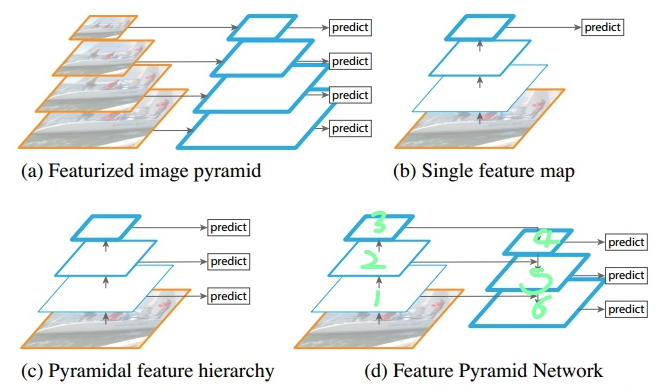
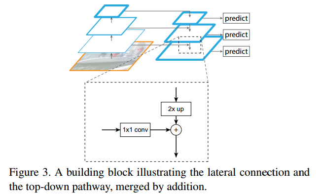

# FPN：Feature Pyramid Networks for OD

论文：https://arxiv.org/abs/1612.03144

Caffe：https://github.com/unsky/FPN

特征金子塔。

识别不同大小的物体是计算机视觉中的一个基本挑战，我们常用的解决方案是构造多尺度金字塔。

a. 一种时图像金子塔，分别提取特征，然后预测边框位置。有较好的检测精度。

b. 利用卷积网络本身的特性，即对原始图像进行卷积和池化操作，通过这种操作我们可以获得不同尺寸的feature map。实验表明，浅层的网络更关注于细节信息，高层的网络更关注于语义信息，而高层的语义信息能够帮助我们准确的检测出目标，因此我们可以利用最后一个卷积层上的feature map来进行预测。它的缺点是我们仅仅关注深层网络中最后一层的特征，却忽略了其它层的特征，但是细节信息可以在一定程度上提升检测的精度。

c. 利用不同层的特征分别进行预测，不需要经过所有层才能输出对应的目标。对于有些目标来说不需要多余的前向操作。

d. 对Layer4上面的特征就行上采样操作，使得它们具有相应的尺寸，然后对处理后的Layer2和处理后的Layer4执行加法操作（对应元素相加）。

我们将处理过的低层特征和处理过的高层特征进行累加，这样做的目的是因为低层特征可以提供更加准确的位置信息，而多次的降采样和上采样操作使得深层网络的定位信息存在误差，因此我们将其结合其起来使用，

## FPN框架解析

https://www.cnblogs.com/hansjorn/p/12510888.html

xxx

xxx