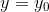

# 1. R-FCN

全称：Region-based Fully Convolution Networks，基于Region的全卷积网络。

对比Fast/Faster R-CNN等基于Region的目标检测器，文章提出了一种全卷机的方法，避免了在每个区域都要跑一遍小网络的耗时操作。（当然，这里不是说每个RoI的操作不是一点也没有，而是：All learnable weight layers are convolutional and are computed on the entire image; the per-RoI computational cost negligible。）

R-FCN使用101层的ResNet，在PASCAL 2007 VOC数据集取得83.6%的mAP。

## 1.1. 特点

对于目标检测任务，一类比较流行的算法是使用RoI Pooling将整个网络分成2个子网络：(1) 共享的全卷积子网络，用于提取特征，与RoI无关; (2) 每个RoI相关的子网络，用于分类和边框回归。

第二个子网络用于预测每个RoI的类别和边框。如果改为全卷积，且batch=1，则会遇到translation invariance和variance的两难问题。即，预测类别要求第二个子网络有平移不变性，而预测边框要求网络有平移变化性。

## 1.2. 方案

整体结构：

整体结构类似于Faster R-CNN，先用CNN提取feature map，然后使用RPN得到候选RoI。

将feature map再加一层conv，得到 (k x k) x (C + 1) 维的特征，即所谓position-sensitive score maps。每个RoI的特征经过Position-sensitive RoI Pooling得到（C+1）x1 的置信度 或者 x4 的位置。

Position-sensitive RoI Pooling 的处理方式如下图所示：

为了能explicitly、明确地、显式地将位置信息编码进每个RoI，将每个RoI分成kxk的grid，进而得到kxk的bin（grid cell）。对于一个wxh的RoiI区域，一个bin来自w/k x h/k的grid cell。

这样会得到 (C+1)-d (kxk) 的输出即（kxk）的position sensitive score maps。

### 1.2.1 classification

文章中简单地将kxk的score求平均得到1个值，即得到（C+1）x1的输出。，然后使用softmax，即可以得到每个类别的概率，。

### 1.2.2 bounding box regression

这里以class-agnostic的bbox regression为例：

在(C+1)x(kxk) 维的position sensitive score mas 之后。再使用一个conv，得到4x(kxk)-d的特征。然后使用PS RoI Pooling得到4-d (kxk)的特征。然后再平均得到 4-d 1的特征，即t=(tx, ty, tw, th)。

### 1.2.3 class-agnostic？

https://www.quora.com/What-does-%E2%80%9Cclass-agnostic%E2%80%9D-in-most-of-the-object-detection-papers-mean?utm_medium=organic&utm_source=google_rich_qa&utm_campaign=google_rich_qa

agnostic的意思是不可知论的。class-agnostic就是不管类别。class-agnositic其实是foreground（各种有效类别）和background分开的bbox regression。根据classification的类别判断，确定bounding bbox是否有效及何种类别。

对于class-specific的bbox regression，每个类别给一个bbox，如C+1类，各有一个bbox。具体选那个bbox，使用classification的类别去选择。如果是这种情况，则需要Cx4x(kxk)-d特征，经过PS RoI pooling后，得到Cx4-d的kxk特征，在经过平均，得到Cx4-d x1的特征。

# 2. 图像领域基础知识

图像的基本变换：平移（translate）、旋转（rotate）、缩放（scale）和错切（skew）。

线性变换：旋转、缩放、错切。

平移变换：平移。

仿射变换：线性变换、平移变换。

**旋转**

假定一个点 A(x0, y0) ,距离原点距离为 r, 与水平轴夹角为 α 度, 绕原点旋转 θ 度, 旋转后为点 B(x, y) 如下: 

 
 
 
 
**用矩阵表示:** 
 
**图例:** 

**错切**

错切存在两种特殊错切，水平错切(平行X轴)和垂直错切(平行Y轴)。

**水平错切** 

 
 
**用矩阵表示:** 

 
**图例:** 

