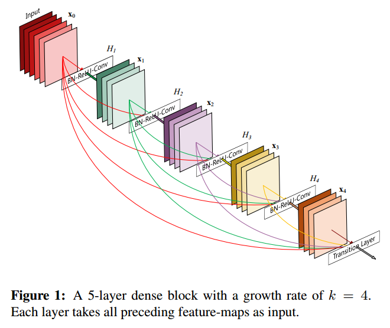
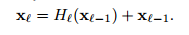
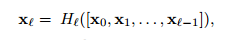
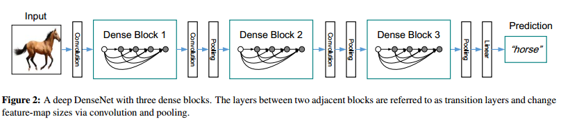
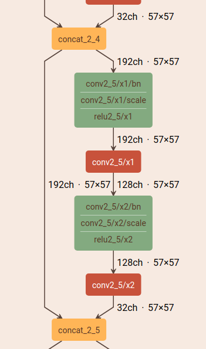
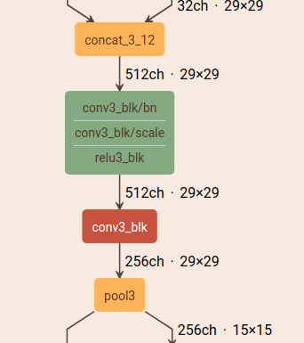
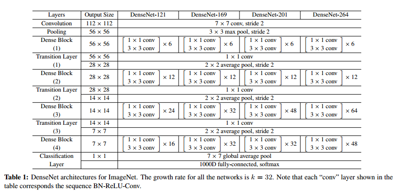

# 1 DenseNet

Densely Connected Convolutional Networks

## 1.1 Abstract

最近的一系列工作显示：shot connect能让CNN能够做得更深、更准确且更容易训练。

DenseNet将这一观察推广到极致。之前的ResNet将两层layer直接eltwise。对于L层的CNN，使用DenseNet可以建立(L+1)L/2个direct connection。每一个layer的输出都会直接shortcut到后面的每一layer。连接更加稠密。

好处：缓解梯度消失问题、加强特征传播（每一个卷积都能利用之前的所有浅层特征）、加强特征复用、极大减少参数个数。

## 1.2 Introduction

DenseNet结构的设计如图所示：

每一个layer都是使用全面所有层的特征，并自己的特征给后面所有层使用。

实现方式是：不使用eltwise，使用concat。concat能直接传递，不经过任何计算，而且天然地使feature越来越宽。

BN+ReLU+Conv3x3

ResNet的公式：

DenseNet的公式：

x

**DenseNet结构因为使用concat讲多层特征拼接，因而要求feature map size保持不变。而CNN的一大主要结构时downsampling。**

To facilitate down-sampling in our architecture we divide the network into multiple densely connected dense blocks。

**transition layers**

DenseBlock之间做conv和pooling的层叫transition layers，有 BN+conv1x1+pool2x2 构成。

**Growth rate**

If each function H_l produces k featuremaps, it follows that the ‘th layer has k0 + k ×(l −1) input
feature-maps, where k0 is the number of channels in the input layer. 

**Bottleneck layers**

Bottleneck layer在ResNet中就有提及，主要降低channel数，防止计算量暴增。DenseNet-121使用conv1x1产生固定的4k channel的feature map，然后再进行conv3x3。这称作DesNet-B。

**Compression**

transition layer层还可以进一步压缩feature map的个数。如果denseblock输出了m个feature map。transition layer降低为 $\theta m$，$\theta <= 1$，这成为Densenet-C。DenseNet-121中使用$\theta=0.5$。

如果同时使用DenseNet-B和DenseNet-C，则称为DenseNet-BC。

## 1.3 具体设计

xx

xx