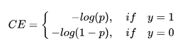
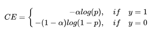
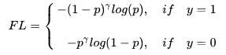
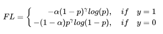

# Focal Loss

解决样本不平衡的问题。

针对目标检测问题，主要有两种问题：正负样本数量不平衡、难易样本数量不平衡。

对于**单阶段目标检测器**，通常会产生100K的候选区域，其中只有极少数是正样本。这就是正负样本数量不平衡。

 分类任务使用的Cross Entropy公式：

为了解决**正负样本不平衡**的问题，在正负样本前面加上参数$alpha$

目标检测中大量候选区域（候选样本）是损失很小的易样本，主导了总的损失。作者认为：

而本文的作者认为，**易分样本（即，置信度高的样本）对模型的提升效果非常小，模型应该主要关注与那些难分样本。**（这个假设是有问题的，让模型过多关注那些特别难分的样本肯定是存在问题的，样本中有**离群点（outliers）**，可能模型已经收敛了但是这些离群点还是会被判断错误，让模型去关注这样的样本，怎么可能是最好的呢？GHM进行了改进）。

解决难易样本不平衡的方式：降低高置信度（置信度，p）样本损失的权重。

对于正样本，p越大表示越确信，通过 (1-p)^gamma，降低损失权重。

对于负样本，p越小表示越确信，通过p^gamma，降低损失权重。

最终Focal loss的公式：

实验表明：gamma=2, alpha=0.25时效果最佳。

参考资料：

https://www.zhihu.com/search?type=content&q=focal%20loss

