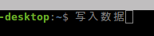

# 1 修改Ubuntu默认中文字体

Ubuntu的默认系统字体（我使用的版本为Ubuntu16.04）比较奇怪。比较明显的是“写”这个字，极为异常，给文本阅读编辑造成困扰。



文泉驿微米黑是比较成熟的开元字体，可用于ubuntu。经查阅资料，已在Ubuntu16.04上修改成功。


#### 下载安装字体

```shell
sudo apt-get install ttf-wqy-microhei
```

安装成功提示：

```powershell
chen@chen-desktop:~$ sudo apt-get install fonts-wqy-microhei
Reading package lists... Done
Building dependency tree       
Reading state information... Done
The following NEW packages will be installed:
  fonts-wqy-microhei
0 upgraded, 1 newly installed, 0 to remove and 677 not upgraded.
Need to get 1,607 kB of archives.
After this operation, 5,291 kB of additional disk space will be used.
Get:1 http://cn.archive.ubuntu.com/ubuntu xenial/universe amd64 fonts-wqy-microhei all 0.2.0-beta-2 [1,607 kB]
Fetched 1,607 kB in 2min 6s (12.7 kB/s)                                                                               
Selecting previously unselected package fonts-wqy-microhei.
(Reading database ... 305215 files and directories currently installed.)
Preparing to unpack .../fonts-wqy-microhei_0.2.0-beta-2_all.deb ...
Unpacking fonts-wqy-microhei (0.2.0-beta-2) ...
Processing triggers for fontconfig (2.11.94-0ubuntu1.1) ...
Setting up fonts-wqy-microhei (0.2.0-beta-2) ...
chen@chen-desktop:~$ 
```

#### 全局设置字体

安装成功后，修改配置文件，启用字体。

创建/etc/fonts/local.conf。讲中文字体修改为文泉驿微米黑，又不改变英文字体。

```xml
<fontconfig>

	<match target="pattern">
		<test qual="any" name="family">
			<string>serif</string>
		</test>
		<edit name="family" mode="prepend" binding="strong">
			<string>WenQuanYi Micro Hei</string>
			<string>AR PL UMing CN</string>
			<string>AR PL ShanHeiSun Uni</string>
			<string>WenQuanYi Bitmap Song</string>
			<string>Bitstream Vera Serif</string>
			<string>DejaVu Serif</string>
			<string>AR PL UKai CN</string>
			<string>AR PL ZenKai Uni</string>
		</edit>
	</match> 
	<match target="pattern">
		<test qual="any" name="family">
			<string>sans-serif</string>
		</test>
		<edit name="family" mode="prepend" binding="strong">
			<string>WenQuanYi Micro Hei</string>
			<string>Bitstream Vera Sans</string>
			<string>DejaVu Sans</string>
			<string>WenQuanYi Zen Hei</string>
			<string>AR PL UMing CN</string>
			<string>AR PL ShanHeiSun Uni</string>
			<string>WenQuanYi Bitmap Song</string>
			<string>AR PL UKai CN</string>
			<string>AR PL ZenKai Uni</string>
		</edit>
	</match> 
	<match target="pattern">
		<test qual="any" name="family">
			<string>monospace</string>
		</test>
		<edit name="family" mode="prepend" binding="strong">
			<string>WenQuanYi Micro Hei Mono</string>
			<string>Bitstream Vera Sans Mono</string>
			<string>DejaVu Sans Mono</string>
			<string>WenQuanYi Zen Hei</string>
			<string>AR PL UMing CN</string>
			<string>AR PL ShanHeiSun Uni</string>
			<string>WenQuanYi Bitmap Song</string>
			<string>AR PL UKai CN</string>
			<string>AR PL ZenKai Uni</string>
		</edit>
	</match> 

</fontconfig>
```

修改完成后，无需重启。

#### 验证字体生效

新开一个应用，即可看到字体变化。